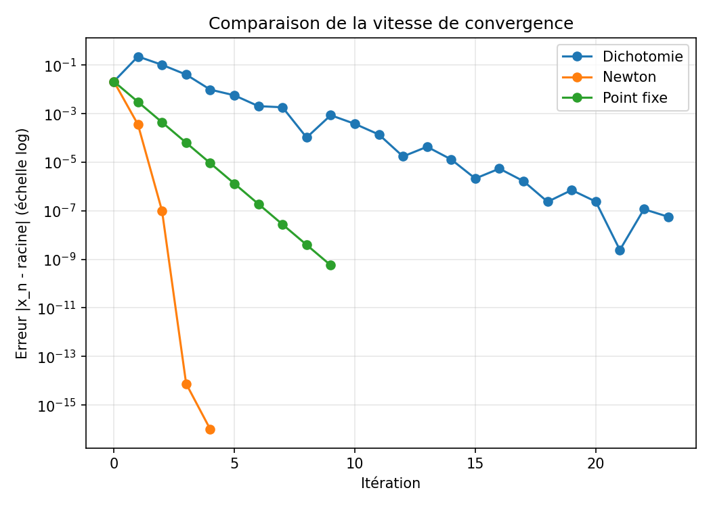

# 🎯 Résolution d'équations non linéaires

[](https://github.com/TifaniohMF/ResolutionEquationNonLineaire/actions/workflows/ci.yml)
[](https://www.python.org/)
[](LICENSE)

Implémentation en Python de méthodes numériques classiques pour trouver les racines (zéros) d'équations non linéaires de la forme **f(x) = 0**, avec visualisation graphique de la convergence.

<p align="center">
  
</p>

## 🚀 À propos

La résolution d'équations non linéaires est un pilier de l'analyse numérique : dès qu'une équation ne peut pas être résolue analytiquement (formule fermée), on se tourne vers des méthodes itératives. Ce dépôt implémente les trois méthodes les plus couramment enseignées, avec une API cohérente, des tests automatisés et des outils de visualisation permettant de comparer leur comportement.

## 🛠️ Méthodes implémentées

| Méthode | Principe | Convergence | Prérequis |
|---|---|---|---|
| **Dichotomie** | Divise l'intervalle en deux à chaque étape | Linéaire, mais garantie | f continue, f(a)·f(b) < 0 |
| **Newton-Raphson** | Approxime f par sa tangente | Quadratique (très rapide) | f dérivable, connaître f' |
| **Point fixe** | Réécrit f(x)=0 en x=g(x) et itère | Linéaire si g contractante | \|g'(x)\| < 1 au voisinage de la racine |

Le graphique ci-dessus (généré par [`examples/demo.py`](examples/demo.py)) illustre concrètement cet écart : sur le même problème, Newton atteint la précision machine en 4 itérations là où la dichotomie en nécessite plus de 20.

## 📁 Structure du projet

```
ResolutionEquationNonLineaire/
├── src/
│   ├── exceptions.py              # Exceptions personnalisées partagées
│   ├── visualisation.py           # Tracé de fonctions et de courbes de convergence
│   ├── methode_dichotomie/
│   │   └── dichotomie.py
│   ├── methode_newton/
│   │   └── newton.py
│   └── methode_point_fixe/
│       └── point_fixe.py
├── tests/                         # Suite de tests pytest
│   ├── test_dichotomie.py
│   ├── test_newton.py
│   ├── test_point_fixe.py
│   └── test_comparaison.py
├── examples/
│   └── demo.py                    # Script de démonstration complet
├── docs/
│   ├── images/                    # Graphiques générés
│   └── ResolutionEquationNonLineaire.pdf   # Note mathématique détaillée
├── .github/workflows/ci.yml       # Intégration continue (lint + tests)
├── pyproject.toml
├── requirements.txt
└── requirements-dev.txt
```

## 📋 Installation

Prérequis : **Python 3.10+**

```bash
git clone https://github.com/TifaniohMF/ResolutionEquationNonLineaire.git
cd ResolutionEquationNonLineaire
pip install -r requirements.txt          # dépendances d'exécution
pip install -r requirements-dev.txt      # + dépendances de développement (tests, lint)
```

## 💻 Utilisation

Chaque méthode expose une fonction unique qui renvoie un objet résultat (dataclass) contenant la racine, le nombre d'itérations et l'historique complet des approximations — utile pour l'analyse ou la visualisation.

```python
from src.methode_dichotomie.dichotomie import dichotomie
from src.methode_newton.newton import newton
from src.methode_point_fixe.point_fixe import point_fixe

f = lambda x: x**3 - x - 2
df = lambda x: 3 * x**2 - 1

resultat = newton(f, df, x0=1.5)
print(resultat.racine)       # 1.5213797068045675
print(resultat.iterations)   # 4
print(resultat.historique)   # [1.5, 1.52..., 1.5213797..., ...]
```

### Visualiser la convergence

```python
from src.visualisation import tracer_convergence

tracer_convergence({
    "Newton": resultat_newton.historique,
    "Dichotomie": resultat_dichotomie.historique,
})
```

### Lancer la démo complète

```bash
python examples/demo.py
```

Ce script résout la même équation avec les trois méthodes, affiche les résultats dans le terminal et régénère les graphiques de `docs/images/`.

## 🧪 Tests

La suite de tests couvre les cas nominaux, les cas limites (racine sur une borne, dérivée nulle, fonction non contractante) et la cohérence entre méthodes.

```bash
pytest                    # lance les tests avec couverture de code
ruff check src tests      # vérifie le style et la qualité du code
```

Les tests s'exécutent automatiquement sur chaque push et pull request via GitHub Actions (Python 3.10, 3.11, 3.12).

## 📊 Personnaliser les paramètres

| Paramètre | Méthode(s) | Rôle |
|---|---|---|
| `f`, `g` | toutes | Fonction dont on cherche un zéro (ou fonction de point fixe) |
| `df` | Newton | Dérivée de f |
| `a`, `b` | Dichotomie | Bornes de l'intervalle initial (f(a)·f(b) < 0) |
| `x0` | Newton, Point fixe | Estimation initiale |
| `tol` | toutes | Tolérance sur la précision souhaitée |
| `max_iter` | toutes | Nombre maximal d'itérations avant abandon |

## 🤝 Contribuer

Les contributions sont les bienvenues, notamment pour ajouter de nouvelles méthodes (sécante, Brent, Newton multidimensionnel...).

```bash
git checkout -b feature/nouvelle-methode
# ... vos modifications, avec tests associés ...
git commit -m "feat: ajout de la méthode de la sécante"
git push origin feature/nouvelle-methode
```

Puis ouvrez une pull request. Merci de vous assurer que `pytest` et `ruff check` passent avant de soumettre.

## 📄 Licence

Distribué sous licence [MIT](LICENSE).

## Contact

**TifaniohMF** — [Profil GitHub](https://github.com/TifaniohMF)
